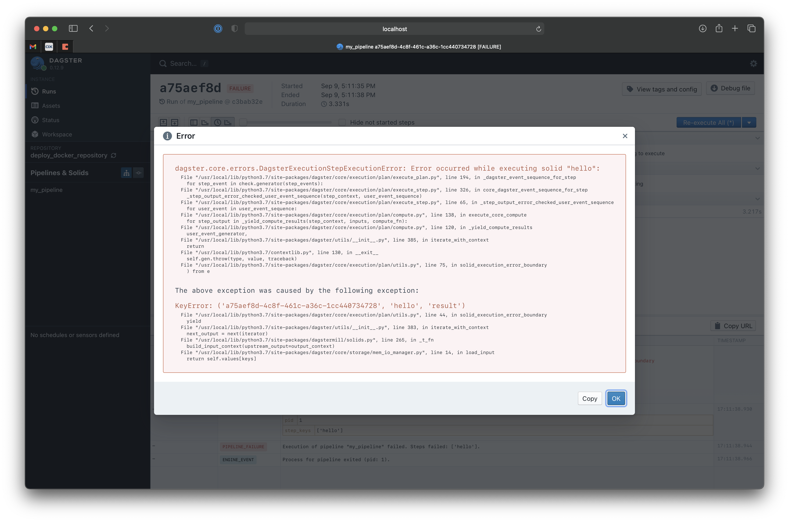

# dagstermill min failing example

This repository shows what happens when you do not provide a file manager and attempt to run a dagstermill solid **without providing a filemanager**

github issue [here](https://github.com/dagster-io/dagster/issues/4788)
